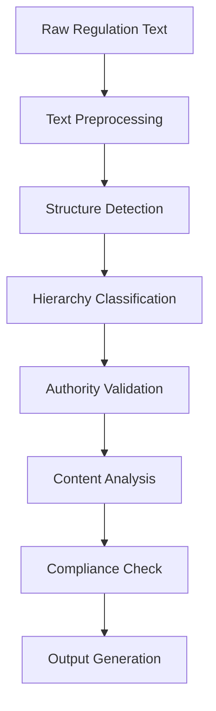

# AI Analysis Guide - Panduan Analisis AI untuk Peraturan Perundang-undangan Indonesia

## 🤖 Overview

Panduan ini dirancang khusus untuk AI-agent yang akan menganalisis peraturan perundang-undangan Indonesia. Format dan struktur dirancang untuk pemrosesan otomatis sambil tetap mudah dibaca oleh manusia.

## 🔧 AI Analysis Architecture

### Input Processing Pipeline


### Core Analysis Modules

#### 1. Document Classification Module
```python
class RegulationClassifier:
    def __init__(self):
        self.hierarchy_levels = {
            1: "UUD_1945",
            2: "TAP_MPR", 
            3: "UU_PERPPU",
            4: "PP",
            5: "PERPRES",
            6: "PERDA_PROVINSI", 
            7: "PERDA_KABUPATEN_KOTA",
            8: "PERMEN_SPECIAL"
        }
    
    def classify_regulation(self, text):
        # Classification logic here
        return classification_result
```

#### 2. Authority Validation Module
```python
class AuthorityValidator:
    def validate_issuing_authority(self, regulation_type, issuer):
        authority_matrix = {
            "UU": ["DPR", "PRESIDEN"],
            "PP": ["PRESIDEN"], 
            "PERPRES": ["PRESIDEN"],
            "PERDA_PROVINSI": ["DPRD_PROVINSI", "GUBERNUR"],
            "PERDA_KABUPATEN": ["DPRD_KABUPATEN", "BUPATI"],
            "PERMEN": ["MENTERI"]
        }
        return issuer in authority_matrix.get(regulation_type, [])
```

#### 3. Hierarchy Compliance Checker
```python
class HierarchyChecker:
    def check_compliance(self, regulation, higher_regulations):
        compliance_score = 0
        conflicts = []
        
        for higher_reg in higher_regulations:
            if self.has_conflict(regulation, higher_reg):
                conflicts.append(higher_reg)
            else:
                compliance_score += 1
                
        return {
            'score': compliance_score / len(higher_regulations),
            'conflicts': conflicts
        }
```

## 📋 Structured Data Extraction

### Regulation Metadata Schema
```json
{
  "regulation_metadata": {
    "id": "string",
    "type": "enum[UU|PP|PERPRES|PERDA_PROV|PERDA_KAB|PERMEN]",
    "number": "string", 
    "year": "integer",
    "title": "string",
    "issuer": "string",
    "date_issued": "date",
    "date_effective": "date",
    "legal_basis": ["array_of_legal_references"],
    "hierarchy_level": "integer",
    "status": "enum[ACTIVE|REVOKED|AMENDED|SUSPENDED]"
  }
}
```

### Content Structure Schema
```json
{
  "regulation_content": {
    "preamble": {
      "considerations": ["array_of_considerations"],
      "legal_basis": ["array_of_legal_basis"], 
      "decisions": ["array_of_decisions"]
    },
    "chapters": [
      {
        "chapter_number": "integer",
        "chapter_title": "string", 
        "articles": [
          {
            "article_number": "integer",
            "article_title": "string",
            "paragraphs": ["array_of_paragraphs"],
            "provisions": ["array_of_provisions"]
          }
        ]
      }
    ],
    "closing": {
      "transitional_provisions": ["array"],
      "final_provisions": ["array"]
    }
  }
}
```

## 🎯 Analysis Workflows

### Workflow 1: New Regulation Analysis
```python
def analyze_new_regulation(regulation_text):
    # Step 1: Extract metadata
    metadata = extract_metadata(regulation_text)
    
    # Step 2: Classify hierarchy level
    hierarchy_level = classify_hierarchy(metadata)
    
    # Step 3: Validate authority
    authority_valid = validate_authority(metadata, hierarchy_level)
    
    # Step 4: Check compliance with higher regulations
    compliance = check_hierarchy_compliance(regulation_text, hierarchy_level)
    
    # Step 5: Analyze content quality
    quality_score = analyze_content_quality(regulation_text)
    
    # Step 6: Generate analysis report
    return generate_report({
        'metadata': metadata,
        'hierarchy_level': hierarchy_level,
        'authority_valid': authority_valid, 
        'compliance': compliance,
        'quality_score': quality_score
    })
```

### Workflow 2: Bulk Compliance Audit
```python
def audit_regulation_compliance(regulations_database):
    compliance_report = {}
    
    for regulation in regulations_database:
        # Get higher level regulations
        higher_regs = get_higher_level_regulations(regulation)
        
        # Check each compliance aspect
        compliance_report[regulation.id] = {
            'hierarchy_compliance': check_hierarchy_compliance(regulation, higher_regs),
            'authority_compliance': check_authority_compliance(regulation),
            'procedural_compliance': check_procedural_compliance(regulation),
            'constitutional_compliance': check_constitutional_compliance(regulation)
        }
    
    return compliance_report
```

### Workflow 3: Impact Analysis
```python
def analyze_regulation_impact(regulation, related_regulations):
    impact_analysis = {
        'legal_impact': analyze_legal_impact(regulation, related_regulations),
        'economic_impact': analyze_economic_impact(regulation),
        'social_impact': analyze_social_impact(regulation), 
        'administrative_impact': analyze_administrative_impact(regulation)
    }
    
    return impact_analysis
```

## 🔍 Pattern Recognition

### Common Legal Patterns
```python
legal_patterns = {
    'delegation_patterns': [
        r'diatur lebih lanjut dengan Peraturan Pemerintah',
        r'ketentuan lebih lanjut diatur dalam Peraturan Menteri',
        r'pelaksanaan.*diatur dengan Peraturan Daerah'
    ],
    'authority_patterns': [
        r'berdasarkan.*Pasal \d+ (UU|PP|Perpres)',
        r'dalam rangka melaksanakan.*',
        r'untuk melaksanakan ketentuan.*'
    ],
    'temporal_patterns': [
        r'mulai berlaku.*tanggal.*', 
        r'berlaku selama.*tahun',
        r'dicabut dan dinyatakan tidak berlaku'
    ]
}
```

### Conflict Detection Patterns
```python
conflict_indicators = {
    'contradictory_provisions': [
        r'dilarang.*',
        r'tidak boleh.*',
        r'wajib.*',
        r'harus.*'
    ],
    'overlapping_authority': [
        r'berwenang.*',
        r'bertugas.*', 
        r'bertanggung jawab.*'
    ],
    'inconsistent_definitions': [
        r'yang dimaksud dengan.*adalah.*',
        r'definisi.*',
        r'pengertian.*'
    ]
}
```

## 📊 Scoring and Rating System

### Compliance Scoring Algorithm
```python
def calculate_compliance_score(regulation_analysis):
    weights = {
        'hierarchy_compliance': 0.3,
        'authority_validity': 0.25, 
        'procedural_compliance': 0.2,
        'content_quality': 0.15,
        'implementation_feasibility': 0.1
    }
    
    total_score = 0
    for aspect, weight in weights.items():
        aspect_score = regulation_analysis[aspect]
        total_score += aspect_score * weight
    
    return {
        'total_score': total_score,
        'grade': get_grade(total_score),
        'recommendations': generate_recommendations(regulation_analysis)
    }

def get_grade(score):
    if score >= 0.9: return 'A'
    elif score >= 0.8: return 'B'
    elif score >= 0.7: return 'C' 
    elif score >= 0.6: return 'D'
    else: return 'F'
```

### Risk Assessment Matrix
```python
risk_levels = {
    'HIGH': {
        'score_threshold': 0.3,
        'indicators': [
            'constitutional_violation',
            'authority_excess', 
            'procedural_invalidity'
        ],
        'action': 'immediate_review_required'
    },
    'MEDIUM': {
        'score_threshold': 0.7,
        'indicators': [
            'minor_conflicts',
            'implementation_challenges',
            'coordination_issues'
        ], 
        'action': 'scheduled_review_recommended'
    },
    'LOW': {
        'score_threshold': 0.9,
        'indicators': [
            'minor_technical_issues',
            'formatting_inconsistencies'
        ],
        'action': 'routine_monitoring'
    }
}
```

## 🚨 Alert Generation System

### Alert Types and Triggers
```python
alert_system = {
    'CRITICAL': {
        'triggers': [
            'constitutional_violation_detected',
            'ultra_vires_authority',
            'major_hierarchy_conflict'
        ],
        'response_time': 'immediate',
        'notification_level': 'executive'
    },
    'WARNING': {
        'triggers': [
            'potential_conflict_detected', 
            'implementation_difficulty',
            'stakeholder_concerns'
        ],
        'response_time': '24_hours',
        'notification_level': 'management'
    },
    'INFO': {
        'triggers': [
            'new_regulation_published',
            'routine_compliance_check',
            'statistical_updates'
        ],
        'response_time': 'next_business_day', 
        'notification_level': 'operational'
    }
}
```

## 📈 Analytics and Reporting

### Key Performance Indicators (KPIs)
```python
kpi_metrics = {
    'compliance_kpis': {
        'overall_compliance_rate': 'percentage_compliant_regulations',
        'hierarchy_consistency_rate': 'percentage_hierarchy_compliant',
        'authority_validity_rate': 'percentage_valid_authority',
        'implementation_success_rate': 'percentage_successfully_implemented'
    },
    'quality_kpis': {
        'average_quality_score': 'mean_regulation_quality',
        'improvement_trend': 'quality_score_trend_over_time',
        'best_practice_adoption': 'percentage_following_best_practices'
    },
    'efficiency_kpis': {
        'review_processing_time': 'average_time_to_complete_review',
        'automated_detection_rate': 'percentage_issues_auto_detected', 
        'false_positive_rate': 'percentage_false_alerts'
    }
}
```

### Report Generation Templates
```python
def generate_compliance_report(analysis_results):
    report = {
        'executive_summary': {
            'total_regulations_analyzed': len(analysis_results),
            'overall_compliance_rate': calculate_overall_compliance(analysis_results),
            'key_findings': extract_key_findings(analysis_results),
            'recommendations': generate_high_level_recommendations(analysis_results)
        },
        'detailed_analysis': {
            'hierarchy_compliance': analyze_hierarchy_compliance(analysis_results),
            'authority_validation': analyze_authority_validation(analysis_results), 
            'content_quality': analyze_content_quality(analysis_results),
            'implementation_assessment': analyze_implementation_feasibility(analysis_results)
        },
        'risk_assessment': {
            'high_risk_regulations': filter_high_risk(analysis_results),
            'medium_risk_regulations': filter_medium_risk(analysis_results),
            'mitigation_strategies': generate_mitigation_strategies(analysis_results)
        },
        'appendices': {
            'methodology': 'analysis_methodology_description',
            'data_sources': 'list_of_data_sources',
            'technical_notes': 'technical_implementation_notes'
        }
    }
    return report
```

## 🔧 Technical Implementation Guidelines

### Database Schema for Regulation Storage
```sql
CREATE TABLE regulations (
    id VARCHAR(50) PRIMARY KEY,
    type ENUM('UU','PP','PERPRES','PERDA_PROV','PERDA_KAB','PERMEN'),
    number VARCHAR(20),
    year INT,
    title TEXT,
    issuer VARCHAR(100),
    date_issued DATE,
    date_effective DATE, 
    status ENUM('ACTIVE','REVOKED','AMENDED','SUSPENDED'),
    hierarchy_level INT,
    content_text LONGTEXT,
    metadata_json JSON,
    created_at TIMESTAMP DEFAULT CURRENT_TIMESTAMP,
    updated_at TIMESTAMP DEFAULT CURRENT_TIMESTAMP ON UPDATE CURRENT_TIMESTAMP
);

CREATE INDEX idx_type_year ON regulations(type, year);
CREATE INDEX idx_hierarchy_level ON regulations(hierarchy_level);
CREATE INDEX idx_status ON regulations(status);
```

### API Endpoints for AI Analysis
```python
# FastAPI implementation example
from fastapi import FastAPI, UploadFile, File
from typing import List, Dict, Any

app = FastAPI(title="Indonesia Legal Analysis API")

@app.post("/analyze/regulation")
async def analyze_regulation(regulation_text: str) -> Dict[str, Any]:
    """Analyze a single regulation for compliance and quality."""
    return perform_regulation_analysis(regulation_text)

@app.post("/analyze/bulk") 
async def bulk_analyze(file: UploadFile = File(...)) -> Dict[str, Any]:
    """Perform bulk analysis on multiple regulations."""
    return perform_bulk_analysis(file)

@app.get("/compliance/report/{regulation_id}")
async def get_compliance_report(regulation_id: str) -> Dict[str, Any]:
    """Get detailed compliance report for specific regulation."""
    return generate_detailed_compliance_report(regulation_id)

@app.post("/validate/hierarchy")
async def validate_hierarchy(regulation_data: Dict[str, Any]) -> Dict[str, Any]:
    """Validate regulation against hierarchy requirements."""
    return validate_regulation_hierarchy(regulation_data)
```

## 📚 Training Data Requirements

### Annotated Dataset Structure
```json
{
  "training_data": {
    "regulation_samples": [
      {
        "id": "sample_001",
        "text": "regulation_full_text",
        "annotations": {
          "hierarchy_level": 3,
          "type": "UU",
          "compliance_score": 0.85,
          "issues": ["minor_formatting", "unclear_delegation"],
          "quality_rating": "B"
        }
      }
    ],
    "validation_cases": [
      {
        "id": "case_001", 
        "scenario": "authority_validation",
        "input": "regulation_excerpt",
        "expected_output": "authority_valid",
        "explanation": "reasoning_for_validation"
      }
    ]
  }
}
```

## 🔍 Quality Assurance

### Validation Checks
```python
def validate_analysis_quality(analysis_result):
    quality_checks = {
        'completeness': check_analysis_completeness(analysis_result),
        'consistency': check_internal_consistency(analysis_result),
        'accuracy': check_analysis_accuracy(analysis_result),
        'reliability': check_analysis_reliability(analysis_result)
    }
    
    overall_quality = sum(quality_checks.values()) / len(quality_checks)
    
    return {
        'quality_score': overall_quality,
        'individual_checks': quality_checks,
        'recommendations': generate_quality_improvement_recommendations(quality_checks)
    }
```

## 🚀 Deployment Considerations

### Scalability Architecture
- **Microservices**: Separate services for different analysis components
- **Container Deployment**: Docker containers for consistent deployment
- **Load Balancing**: Handle multiple concurrent analysis requests
- **Database Optimization**: Efficient storage and retrieval of regulations

### Performance Optimization
- **Caching**: Cache frequently accessed regulations and analysis results
- **Parallel Processing**: Process multiple regulations simultaneously  
- **Incremental Updates**: Update only changed regulations
- **Result Caching**: Store and reuse analysis results

## 📋 Usage Examples

### Example 1: Analyzing New UU
```python
# Input: New UU text
uu_text = """
UNDANG-UNDANG REPUBLIK INDONESIA
NOMOR X TAHUN 2024
TENTANG CONTOH REGULASI
...
"""

# Analysis
result = analyze_regulation(uu_text)
print(f"Compliance Score: {result['compliance_score']}")
print(f"Issues Found: {result['issues']}")
print(f"Recommendations: {result['recommendations']}")
```

### Example 2: Bulk Compliance Audit
```python  
# Load all PP regulations from 2023
pp_regulations = load_regulations(type="PP", year=2023)

# Perform bulk audit
audit_results = audit_regulation_compliance(pp_regulations)

# Generate summary report
summary = generate_audit_summary(audit_results)
print(f"Total Analyzed: {summary['total_count']}")
print(f"Compliance Rate: {summary['compliance_rate']}")
print(f"High Risk Count: {summary['high_risk_count']}")
```

---

## 🎯 Next Steps for Implementation

1. **Setup Development Environment**
   - Configure Python environment with required libraries
   - Setup database for regulation storage
   - Implement basic analysis modules

2. **Data Collection and Preparation** 
   - Gather training data from official sources
   - Annotate sample regulations for training
   - Create validation datasets

3. **Model Training and Testing**
   - Train classification models
   - Test analysis accuracy
   - Validate against known cases

4. **Integration and Deployment**
   - Integrate with official data sources
   - Deploy to production environment
   - Setup monitoring and alerting

5. **Continuous Improvement**
   - Monitor performance metrics
   - Update models with new data
   - Refine analysis algorithms based on feedback

**This guide provides the foundation for building sophisticated AI-powered analysis of Indonesian legal regulations.**